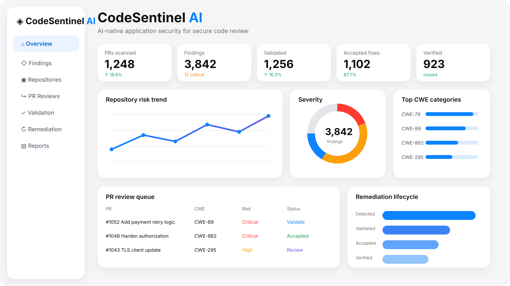
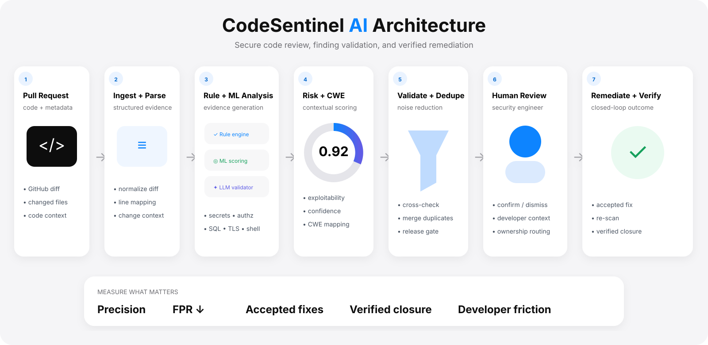

<div align="center">

# CodeSentinel AI

### AI-Native Application Security for Secure Code Review

**Turn code changes into evidence-backed security decisions — then follow findings through validation, developer action, remediation, and verified closure.**

[](https://www.python.org/)
[](https://github.com/VinayK88/CodeSentinel-AI/actions/workflows/tests.yml)


`diff → detect → validate → prioritize → remediate → verify`

</div>

<p align="center"></p>
<p align="center"><sub><b>Product visualization.</b> UI values are illustrative; measured public-replay metrics are reported below.</sub></p>

## The product idea

Most scanners end at **“finding detected.”** CodeSentinel models the decision system around that finding: what changed, what evidence supports the alert, which CWE applies, whether the result survives validation, how risky it is in context, whether a developer accepts the fix, and whether remediation is actually verified.

<table>
<tr>
<td width="25%" valign="top"><b>01 · Detect</b><br/><sub>Explainable checks over PR diffs for secrets, authz weakening, SQL construction, unsafe shell use, TLS bypass and debug exposure.</sub></td>
<td width="25%" valign="top"><b>02 · Validate</b><br/><sub>Evidence, confidence, duplicate suppression and contextual prioritization reduce “scanner says so” noise.</sub></td>
<td width="25%" valign="top"><b>03 · Decide</b><br/><sub>Risk score + CWE + code evidence create a reviewable security decision rather than a black-box label.</sub></td>
<td width="25%" valign="top"><b>04 · Close</b><br/><sub>Lifecycle state connects developer disposition, remediation and re-verification.</sub></td>
</tr>
</table>

## Architecture

<p align="center"></p>

The public implementation keeps **authorization and security policy deterministic** while leaving room for ML/LLM validation behind explicit evidence contracts. Learned scores inform prioritization; they do not silently grant security-sensitive actions.

## Measured synthetic replay

The checked-in replay uses deterministic synthetic PR diffs so the entire evaluation can run offline and be reproduced in CI.

| Metric | Result |
| --- | ---: |
| Labeled finding families detected | **6 / 6** |
| Precision | **1.00** |
| Recall | **1.00** |
| False positives | **0** |
| Critical / high findings | **5 / 6** |
| Distinct CWE mappings | **6** |

> These numbers validate the **implementation and evaluation mechanics on the included synthetic fixture**. They are not claims of production AppSec efficacy.

## Detection coverage

| Signal | Example evidence | CWE |
| --- | --- | --- |
| Hard-coded secret | key / token introduced in code | CWE-798 |
| Authorization weakening | authz control removed in diff | CWE-862 |
| Unsafe SQL construction | string-built query path | CWE-89 |
| Shell execution | `shell=True` / command execution | CWE-78 |
| TLS verification bypass | `verify=False` | CWE-295 |
| Debug exposure | application debug enabled | CWE-489 |

## 60-second reviewer path

1. **Scan the product view and architecture above.**
2. Open [`src/codesentinel/rules.py`](src/codesentinel/rules.py) for explainable AppSec checks.
3. Open [`src/codesentinel/validator.py`](src/codesentinel/validator.py) for confidence, dedupe and risk logic.
4. Inspect [`reports/baseline.json`](reports/baseline.json) for the reproducible evaluation output.
5. Run the Streamlit dashboard for the analyst-facing workflow.

## Run it

```bash
python -m venv .venv
source .venv/bin/activate
python -m pip install -e .
codesentinel --input sample_data/pr_diff.txt
python -m unittest discover -s tests -v
```

### Product dashboard

```bash
python -m pip install streamlit
streamlit run dashboard/app.py
```

The dashboard includes a product-style overview, security posture, severity/CWE views, validated-finding queue, remediation funnel, and evidence drill-down.

## Repository map

```text
src/codesentinel/
├── models.py       typed finding + lifecycle records
├── rules.py        explainable AppSec detectors
├── validator.py    dedupe, confidence + contextual prioritization
├── lifecycle.py    disposition / remediation / verification
├── evaluation.py   replay metrics
└── cli.py          reproducible command-line review
sample_data/        synthetic PR diff + labels
reports/            checked-in measured baseline
assets/             product + architecture visuals
dashboard/          product-style Streamlit review surface
tests/              detector + lifecycle invariants
```

## Production evolution

A production deployment would add GitHub App webhooks, language-aware AST/data-flow analysis, dependency and secret-scanner adapters, SARIF, evidence-constrained LLM validation, policy-as-code release gates, code-owner routing, analyst/developer dispositions, and telemetry linking findings to **accepted fixes and verified closure**.

> **Safety boundary:** CodeSentinel is defensive code-review tooling. It identifies weaknesses and remediation evidence; it does not automate exploitation.
