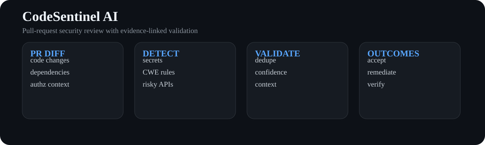
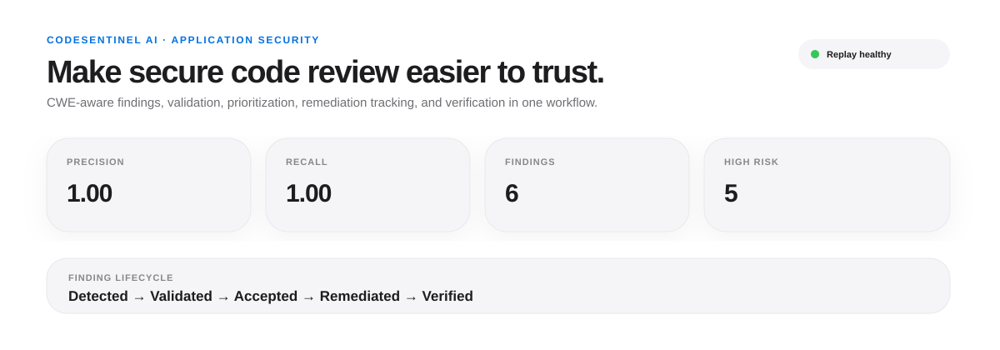

<div align="center">

# CodeSentinel AI

### AI-Native Application Security · PR Security Review · CWE Mapping · Finding Validation

[](https://www.python.org/)
[](https://github.com/VinayK88/CodeSentinel-AI/actions/workflows/tests.yml)


**diff → detect → validate → prioritize → remediate → verify**

</div>

<p align="center"></p>
<p align="center"></p>

## Why this project exists

Security scanners often stop at producing findings. **CodeSentinel AI** models the full application-security decision loop around a pull request: identify risky changes, map evidence to CWE, suppress duplicates/noise, prioritize by exploitability and change context, capture developer disposition, and verify remediation.

The public demo is intentionally deterministic and offline. It uses synthetic diffs and does **not** claim production efficacy.

## 60-second reviewer path

1. Inspect the architecture and sample dashboard above.
2. Run `codesentinel --input sample_data/pr_diff.txt`.
3. Review `src/codesentinel/rules.py` for explainable security checks.
4. Review `src/codesentinel/validator.py` for dedupe/confidence/risk logic.
5. Run the tests and inspect `reports/baseline.json`.

## What it detects

| Signal | Example | CWE |
| --- | --- | --- |
| Secret exposure | API keys / bearer tokens added in code | CWE-798 |
| Command execution risk | `shell=True`, dynamic execution | CWE-78 / CWE-95 |
| SQL construction risk | string-built query paths | CWE-89 |
| TLS verification disabled | `verify=False` | CWE-295 |
| Authorization weakening | removal of authz checks in a diff | CWE-862 |
| Debug configuration | debug mode enabled in application code | CWE-489 |

## Evaluation model

Each finding records evidence, severity, confidence, CWE, line number, and a deterministic risk score. The replay report measures:

- finding precision / recall against labeled synthetic diffs;
- duplicate suppression rate;
- high-risk acceptance rate;
- remediation and verification rate;
- mean findings per PR as an analyst/developer-friction proxy.

## Quick start

```bash
python -m venv .venv
source .venv/bin/activate
python -m pip install -e .
codesentinel --input sample_data/pr_diff.txt
python -m unittest discover -s tests -v
```

Optional dashboard:

```bash
python -m pip install streamlit
streamlit run dashboard/app.py
```

## Repository map

```text
src/codesentinel/
├── models.py       typed finding + lifecycle records
├── rules.py        explainable AppSec detectors
├── validator.py    dedupe, confidence and contextual prioritization
├── lifecycle.py    disposition / remediation / verification state
├── evaluation.py   replay metrics
└── cli.py          reproducible command-line review
sample_data/        synthetic PR diff + labels
reports/            checked-in baseline report
assets/             architecture + dashboard preview
dashboard/          Streamlit investigation surface
tests/              detector and lifecycle invariants
```

## Production evolution

A production version would add GitHub App webhooks, language-aware AST/data-flow analysis, dependency and secret-scanner adapters, an LLM validator behind strict evidence contracts, SARIF output, policy-as-code release gates, code-owner routing, and telemetry linking findings to accepted fixes and verified closure.

> **Safety boundary:** this repository is a defensive code-review system. It reports security weaknesses and remediation-oriented evidence; it does not automate exploitation.
